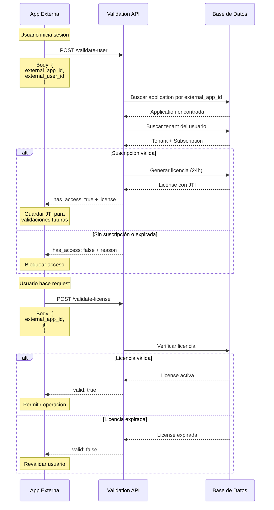

# Autenticación con Validation API usando external_app_id

## Problema Resuelto

**Antes:** Las APIs de validación requerían un `X-API-Key` en el header que solo existía en nuestra base de datos. Las aplicaciones externas no tenían forma de conocer este API Key.

**Ahora:** Todas las APIs usan el `external_app_id` que la aplicación externa YA conoce (es su propio identificador).

---

## ✅ Ventajas del Nuevo Sistema

1. **Sin configuración adicional**: La app externa usa su propio `external_app_id`
2. **Más seguro**: No hay que compartir API Keys generados
3. **Más simple**: Un solo identificador para todas las operaciones
4. **Consistente**: Mismo patrón que `tenant-onboarding`

---

## 📋 APIs Actualizadas

### 1. Validar Usuario

**Endpoint:** `POST /validation-api/validate-user`

**Antes (con API Key en header):**
```bash
curl -X POST \
  'https://veymthufmfqhxxxzfmfi.supabase.co/functions/v1/validation-api/validate-user' \
  -H 'X-API-Key: ak_f5abded75d7545458b952ad4d4aca5b9' \  # ❌ No disponible
  -H 'Content-Type: application/json' \
  -d '{
    "external_user_id": "user_123"
  }'
```

**Ahora (con external_app_id en body):**
```bash
curl -X POST \
  'https://veymthufmfqhxxxzfmfi.supabase.co/functions/v1/validation-api/validate-user' \
  -H 'Content-Type: application/json' \
  -d '{
    "external_app_id": "app_51ecb9e2-6b3",  # ✅ Tu identificador
    "external_user_id": "user_123"
  }'
```

**Request Body:**
```json
{
  "external_app_id": "app_51ecb9e2-6b3",
  "external_user_id": "user_123"  // O usar "user_email": "user@example.com"
}
```

**Response:**
```json
{
  "success": true,
  "has_access": true,
  "tenant": {
    "id": "uuid",
    "name": "Mi Empresa",
    "owner_user_id": "user_123",
    "owner_email": "user@example.com",
    "organization_name": "Mi Empresa SAS",
    "status": "active"
  },
  "subscription": {
    "id": "uuid",
    "status": "trialing",
    "plan_name": "Starter",
    "plan_price": 15,
    "plan_currency": "USD",
    "trial_start": "2025-11-05T00:00:00Z",
    "trial_end": "2025-11-19T00:00:00Z",
    "period_start": "2025-11-05T00:00:00Z",
    "period_end": "2025-11-19T00:00:00Z",
    "entitlements": {
      "max_users": 3,
      "max_storage_gb": 5,
      "features": {
        "api_access": false,
        "advanced_reports": false,
        "priority_support": false
      }
    }
  },
  "license": {
    "jti": "a1b2c3d4-e5f6-7890-abcd-ef1234567890",
    "tenant_id": "uuid",
    "expires_at": "2025-11-06T10:00:00Z",
    "entitlements": { }
  }
}
```

---

### 2. Validar Licencia

**Endpoint:** `POST /validation-api/validate-license`

**Request:**
```json
{
  "external_app_id": "app_51ecb9e2-6b3",
  "jti": "a1b2c3d4-e5f6-7890-abcd-ef1234567890"
}
```

**cURL:**
```bash
curl -X POST \
  'https://veymthufmfqhxxxzfmfi.supabase.co/functions/v1/validation-api/validate-license' \
  -H 'Content-Type: application/json' \
  -d '{
    "external_app_id": "app_51ecb9e2-6b3",
    "jti": "a1b2c3d4-e5f6-7890-abcd-ef1234567890"
  }'
```

**Response (válida):**
```json
{
  "success": true,
  "valid": true,
  "license": {
    "jti": "a1b2c3d4-e5f6-7890-abcd-ef1234567890",
    "tenant_id": "uuid",
    "type": "trial",
    "expires_at": "2025-11-06T10:00:00Z",
    "entitlements": {
      "max_users": 3,
      "max_storage_gb": 5,
      "features": {
        "api_access": false,
        "advanced_reports": false,
        "priority_support": false
      }
    }
  },
  "subscription": {
    "id": "uuid",
    "status": "trialing",
    "plan": {
      "name": "Starter",
      "price": 15,
      "currency": "USD"
    }
  }
}
```

**Response (expirada):**
```json
{
  "success": true,
  "valid": false,
  "reason": "License expired"
}
```

---

### 3. Verificar Feature

**Endpoint:** `GET /validation-api/check-feature`

**Query Parameters:**
- `external_app_id` - Tu identificador de aplicación
- `jti` - Token de licencia
- `feature` - Nombre del feature a verificar

**cURL:**
```bash
curl -X GET \
  'https://veymthufmfqhxxxzfmfi.supabase.co/functions/v1/validation-api/check-feature?external_app_id=app_51ecb9e2-6b3&jti=a1b2c3d4-e5f6-7890&feature=api_access'
```

**Response:**
```json
{
  "success": true,
  "enabled": false,
  "entitlements": {
    "max_users": 3,
    "max_storage_gb": 5,
    "features": {
      "api_access": false,
      "advanced_reports": false,
      "priority_support": false
    }
  }
}
```

---

### 4. Registrar Uso

**Endpoint:** `POST /validation-api/record-usage`

**Request:**
```json
{
  "external_app_id": "app_51ecb9e2-6b3",
  "tenant_id": "uuid",
  "metric": "api_calls",
  "value": 150,
  "metadata": {
    "endpoint": "/users",
    "method": "GET"
  }
}
```

**cURL:**
```bash
curl -X POST \
  'https://veymthufmfqhxxxzfmfi.supabase.co/functions/v1/validation-api/record-usage' \
  -H 'Content-Type: application/json' \
  -d '{
    "external_app_id": "app_51ecb9e2-6b3",
    "tenant_id": "tenant-uuid-here",
    "metric": "api_calls",
    "value": 150,
    "metadata": {
      "endpoint": "/users",
      "method": "GET"
    }
  }'
```

---

## 🔄 Flujo de Autenticación Completo



---

## 📝 Código de Ejemplo

### Node.js / JavaScript

```javascript
// Configuración
const VALIDATION_API = 'https://veymthufmfqhxxxzfmfi.supabase.co/functions/v1/validation-api';
const EXTERNAL_APP_ID = 'app_51ecb9e2-6b3'; // Tu identificador

// 1. Validar usuario al login
async function validateUser(userId) {
  const response = await fetch(`${VALIDATION_API}/validate-user`, {
    method: 'POST',
    headers: { 'Content-Type': 'application/json' },
    body: JSON.stringify({
      external_app_id: EXTERNAL_APP_ID,
      external_user_id: userId
    })
  });

  const data = await response.json();

  if (data.has_access && data.license) {
    // Guardar JTI en sesión/localStorage
    localStorage.setItem('license_jti', data.license.jti);
    localStorage.setItem('license_expires', data.license.expires_at);
    return true;
  }

  return false;
}

// 2. Validar licencia en cada request
async function checkLicense() {
  const jti = localStorage.getItem('license_jti');
  const expires = new Date(localStorage.getItem('license_expires'));

  // Si expira pronto, revalidar
  if (new Date() >= expires) {
    return await revalidateUser();
  }

  const response = await fetch(`${VALIDATION_API}/validate-license`, {
    method: 'POST',
    headers: { 'Content-Type': 'application/json' },
    body: JSON.stringify({
      external_app_id: EXTERNAL_APP_ID,
      jti: jti
    })
  });

  const data = await response.json();
  return data.valid;
}

// 3. Verificar feature específico
async function hasFeature(featureName) {
  const jti = localStorage.getItem('license_jti');

  const response = await fetch(
    `${VALIDATION_API}/check-feature?external_app_id=${EXTERNAL_APP_ID}&jti=${jti}&feature=${featureName}`
  );

  const data = await response.json();
  return data.enabled;
}

// Uso
if (await validateUser('user_123')) {
  console.log('Usuario autenticado');

  if (await checkLicense()) {
    console.log('Licencia válida');

    if (await hasFeature('api_access')) {
      console.log('API access habilitado');
    }
  }
}
```

### PHP

```php
<?php
// Configuración
$VALIDATION_API = 'https://veymthufmfqhxxxzfmfi.supabase.co/functions/v1/validation-api';
$EXTERNAL_APP_ID = 'app_51ecb9e2-6b3';

// Validar usuario
function validateUser($userId) {
    global $VALIDATION_API, $EXTERNAL_APP_ID;

    $data = [
        'external_app_id' => $EXTERNAL_APP_ID,
        'external_user_id' => $userId
    ];

    $ch = curl_init("$VALIDATION_API/validate-user");
    curl_setopt($ch, CURLOPT_POST, 1);
    curl_setopt($ch, CURLOPT_POSTFIELDS, json_encode($data));
    curl_setopt($ch, CURLOPT_RETURNTRANSFER, true);
    curl_setopt($ch, CURLOPT_HTTPHEADER, ['Content-Type: application/json']);

    $response = curl_exec($ch);
    curl_close($ch);

    $result = json_decode($response, true);

    if ($result['has_access'] && isset($result['license'])) {
        $_SESSION['license_jti'] = $result['license']['jti'];
        $_SESSION['license_expires'] = $result['license']['expires_at'];
        return true;
    }

    return false;
}

// Validar licencia
function checkLicense() {
    global $VALIDATION_API, $EXTERNAL_APP_ID;

    if (!isset($_SESSION['license_jti'])) {
        return false;
    }

    $data = [
        'external_app_id' => $EXTERNAL_APP_ID,
        'jti' => $_SESSION['license_jti']
    ];

    $ch = curl_init("$VALIDATION_API/validate-license");
    curl_setopt($ch, CURLOPT_POST, 1);
    curl_setopt($ch, CURLOPT_POSTFIELDS, json_encode($data));
    curl_setopt($ch, CURLOPT_RETURNTRANSFER, true);
    curl_setopt($ch, CURLOPT_HTTPHEADER, ['Content-Type: application/json']);

    $response = curl_exec($ch);
    curl_close($ch);

    $result = json_decode($response, true);
    return $result['valid'] ?? false;
}
?>
```

---

## 🔑 Resumen de Cambios

| API | Campo Anterior | Campo Nuevo | Ubicación |
|-----|----------------|-------------|-----------|
| `/validate-user` | `X-API-Key` header | `external_app_id` body | ✅ Desplegado |
| `/validate-license` | `X-API-Key` header | `external_app_id` body | ✅ Desplegado |
| `/check-feature` | `X-API-Key` header | `external_app_id` query | ✅ Desplegado |
| `/record-usage` | `X-API-Key` header | `external_app_id` body | ✅ Desplegado |

---

## ⚠️ Migración

Si ya tenías código usando el método anterior:

**Antes:**
```javascript
headers: {
  'X-API-Key': 'ak_f5abded75d7545458b952ad4d4aca5b9'
}
```

**Ahora:**
```javascript
body: JSON.stringify({
  external_app_id: 'app_51ecb9e2-6b3',
  // ... resto de datos
})
```

---

## 📞 Soporte

Para cualquier duda sobre el nuevo sistema de autenticación:
- Revisar ejemplos de código arriba
- Verificar que tu `external_app_id` esté activo en la base de datos
- Probar los endpoints con curl para verificar el formato

---

**Fecha de actualización:** 2025-11-05
**Versión API:** 2.1.0
