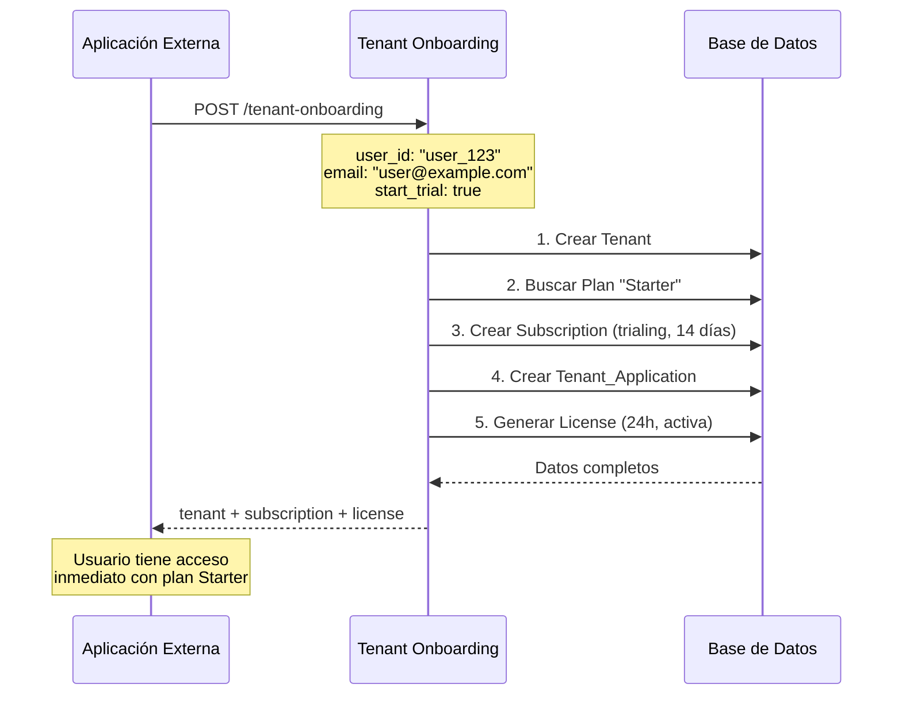

# Guía de API de Licencias y Gestión de Usuarios

Esta guía documenta las actualizaciones realizadas al sistema de licencias y la gestión de usuarios.

## Cambios Importantes

### 1. Sistema de Licencias Automático

Cuando un usuario se registra por primera vez mediante el endpoint de **Tenant Onboarding**, ahora se:
- ✅ Crea automáticamente una suscripción con el plan **Starter** (14 días de trial)
- ✅ Genera automáticamente una **licencia temporal** válida por 24 horas
- ✅ Incluye los `entitlements` del plan en la licencia

### 2. Endpoint de Usuarios Mejorado

El endpoint `GET /admin-api/applications/{application_id}/users` ahora retorna información completa de licencias.

---

## APIs Actualizadas

### 1. Tenant Onboarding (Actualizado)

**Endpoint:** `POST /tenant-onboarding`

**Cambios:**
- Ahora busca automáticamente el plan **"Starter"** en lugar de "Free"
- Genera automáticamente una licencia temporal válida por 24 horas
- La licencia incluye el `jti` (token único) y los entitlements del plan

**Request:**
```json
{
  "external_app_id": "app_51ecb9e2-6b3",
  "user_id": "user_123",
  "email": "usuario@ejemplo.com",
  "name": "Juan Pérez",
  "company_name": "Mi Empresa SAS",
  "start_trial": true
}
```

**Response (Nuevo):**
```json
{
  "success": true,
  "message": "Tenant creado exitosamente",
  "tenant": {
    "id": "uuid",
    "name": "Mi Empresa SAS",
    "owner_user_id": "user_123",
    "owner_email": "usuario@ejemplo.com"
  },
  "subscription": {
    "id": "uuid",
    "status": "trialing",
    "plan_id": "uuid",
    "trial_start": "2025-11-05T00:00:00Z",
    "trial_end": "2025-11-19T00:00:00Z",
    "plan": {
      "name": "Starter",
      "price": 15,
      "currency": "USD",
      "entitlements": {
        "max_users": 3,
        "max_storage_gb": 5,
        "features": {
          "api_access": false,
          "advanced_reports": false,
          "priority_support": false
        }
      }
    }
  },
  "tenant_application": { },
  "is_new": true
}
```

**cURL:**
```bash
curl -X POST \
  'https://veymthufmfqhxxxzfmfi.supabase.co/functions/v1/tenant-onboarding' \
  -H 'Authorization: Bearer YOUR_ANON_KEY' \
  -H 'Content-Type: application/json' \
  -d '{
    "external_app_id": "app_51ecb9e2-6b3",
    "user_id": "user_123",
    "email": "usuario@ejemplo.com",
    "name": "Juan Pérez",
    "company_name": "Mi Empresa SAS",
    "start_trial": true
  }'
```

---

### 2. Obtener Usuarios de Aplicación (Actualizado)

**Endpoint:** `GET /admin-api/applications/{application_id}/users`

**Cambios:**
- Ahora incluye información de **tenant**, **subscription** y **license** para cada usuario
- Incluye la licencia activa más reciente del usuario
- Muestra el token JTI de la licencia

**Headers:**
```
X-Admin-Token: admin_001
Content-Type: application/json
```

**Response (Nuevo):**
```json
{
  "success": true,
  "data": [
    {
      "id": "uuid",
      "external_user_id": "user_123",
      "email": "usuario@ejemplo.com",
      "name": "Juan Pérez",
      "status": "active",
      "last_login": "2025-11-05T10:30:00Z",
      "created_at": "2025-11-01T08:00:00Z",

      "tenant": {
        "id": "uuid",
        "name": "Mi Empresa SAS",
        "status": "active"
      },

      "subscription": {
        "id": "uuid",
        "status": "trialing",
        "plan_name": "Starter",
        "plan_price": 15,
        "plan_currency": "USD",
        "trial_start": "2025-11-05T00:00:00Z",
        "trial_end": "2025-11-19T00:00:00Z",
        "period_start": "2025-11-05T00:00:00Z",
        "period_end": "2025-11-19T00:00:00Z",
        "entitlements": {
          "max_users": 3,
          "max_storage_gb": 5,
          "features": {
            "api_access": false,
            "advanced_reports": false,
            "priority_support": false
          }
        }
      },

      "license": {
        "id": "uuid",
        "jti": "a1b2c3d4-e5f6-7890-abcd-ef1234567890",
        "tenant_id": "uuid",
        "subscription_id": "uuid",
        "type": "trial",
        "status": "active",
        "issued_at": "2025-11-05T10:00:00Z",
        "expires_at": "2025-11-06T10:00:00Z",
        "last_validated_at": "2025-11-05T10:15:00Z",
        "entitlements": {
          "max_users": 3,
          "max_storage_gb": 5,
          "features": {
            "api_access": false,
            "advanced_reports": false,
            "priority_support": false
          }
        }
      }
    }
  ]
}
```

**cURL:**
```bash
curl -X GET \
  'https://veymthufmfqhxxxzfmfi.supabase.co/functions/v1/admin-api/applications/82456535-cc82-454c-a35b-cc7abfc43178/users' \
  -H 'X-Admin-Token: admin_001'
```

---

### 3. Validation API (Sin cambios en request, response mejorado)

**Endpoint:** `POST /validation-api/validate-user`

El response ahora está simplificado y limpio (sin duplicación):

**Request:**
```json
{
  "external_user_id": "user_123"
}
```

**Response (Mejorado):**
```json
{
  "success": true,
  "has_access": true,
  "tenant": {
    "id": "uuid",
    "name": "Mi Empresa SAS",
    "owner_user_id": "user_123",
    "owner_email": "usuario@ejemplo.com",
    "organization_name": "Mi Empresa SAS",
    "status": "active"
  },
  "subscription": {
    "id": "uuid",
    "status": "trialing",
    "plan_name": "Starter",
    "plan_price": 15,
    "plan_currency": "USD",
    "trial_start": "2025-11-05T00:00:00Z",
    "trial_end": "2025-11-19T00:00:00Z",
    "period_start": "2025-11-05T00:00:00Z",
    "period_end": "2025-11-19T00:00:00Z",
    "entitlements": {
      "max_users": 3,
      "max_storage_gb": 5,
      "features": {
        "api_access": false,
        "advanced_reports": false,
        "priority_support": false
      }
    }
  },
  "license": {
    "jti": "a1b2c3d4-e5f6-7890-abcd-ef1234567890",
    "tenant_id": "uuid",
    "expires_at": "2025-11-06T10:00:00Z",
    "entitlements": {
      "max_users": 3,
      "max_storage_gb": 5,
      "features": {
        "api_access": false,
        "advanced_reports": false,
        "priority_support": false
      }
    }
  }
}
```

**Headers:**
```
X-API-Key: ak_f5abded75d7545458b952ad4d4aca5b9
Content-Type: application/json
```

**cURL:**
```bash
curl -X POST \
  'https://veymthufmfqhxxxzfmfi.supabase.co/functions/v1/validation-api/validate-user' \
  -H 'X-API-Key: ak_f5abded75d7545458b952ad4d4aca5b9' \
  -H 'Content-Type: application/json' \
  -d '{
    "external_user_id": "user_123"
  }'
```

---

## Nuevas Tablas en Base de Datos

### Tabla: `licenses`

```sql
CREATE TABLE licenses (
  id uuid PRIMARY KEY DEFAULT gen_random_uuid(),
  jti uuid UNIQUE NOT NULL DEFAULT gen_random_uuid(),
  tenant_id uuid REFERENCES tenants(id) ON DELETE CASCADE NOT NULL,
  subscription_id uuid REFERENCES subscriptions(id) ON DELETE CASCADE NOT NULL,
  type text NOT NULL CHECK (type IN ('trial', 'paid', 'lifetime', 'promotional')),
  status text NOT NULL DEFAULT 'active' CHECK (status IN ('active', 'expired', 'revoked', 'suspended')),
  issued_at timestamptz NOT NULL DEFAULT now(),
  expires_at timestamptz NOT NULL,
  last_validated_at timestamptz,
  entitlements jsonb DEFAULT '{}'::jsonb,
  metadata jsonb DEFAULT '{}'::jsonb,
  created_at timestamptz DEFAULT now(),
  updated_at timestamptz DEFAULT now()
);
```

**Campos clave:**
- `jti`: Token único de la licencia (JWT ID)
- `type`: Tipo de licencia (trial, paid, lifetime, promotional)
- `status`: Estado actual (active, expired, revoked, suspended)
- `expires_at`: Fecha de expiración (típicamente 24 horas desde emisión)
- `entitlements`: Permisos y límites del plan copiados desde la suscripción

---

## Flujo Completo de Usuario Nuevo



---

## Frontend: Modal de Usuarios

El modal de usuarios en el dashboard ahora muestra:

### Información de Suscripción (Tarjeta Azul)
- Estado de la suscripción (Activa, En prueba, Vencida)
- Nombre y precio del plan
- Fecha de fin del trial
- Período de facturación

### Información de Licencia (Tarjeta Verde)
- Estado de la licencia (Activa, Expirada, Revocada)
- Tipo de licencia (trial, paid, lifetime)
- Fecha de expiración
- Token JTI (primeros 16 caracteres)

### Acciones Disponibles
- 🔄 **Renovar Licencia**: Extiende la vigencia de la licencia
- ❌ **Cancelar Suscripción**: Cancela la suscripción (con confirmación)

### Sin Licencia Activa
- ⚠️ Muestra una alerta amarilla indicando que el usuario no tiene suscripción

---

## Próximos Pasos Recomendados

1. **Implementar Renovación de Licencias**
   - Crear endpoint `POST /admin-api/licenses/{license_id}/renew`
   - Actualizar `expires_at` y mantener `status` como 'active'

2. **Implementar Cancelación de Suscripción**
   - Crear endpoint `DELETE /admin-api/subscriptions/{subscription_id}`
   - Cambiar `status` a 'canceled'
   - Establecer `cancel_at` para el fin del período actual

3. **Auto-renovación de Licencias**
   - Crear un cron job que regenere licencias expiradas para suscripciones activas
   - Ejecutar diariamente o cada 12 horas

4. **Limpieza de Licencias Expiradas**
   - Usar la función `cleanup_expired_licenses()` para marcar licencias como 'expired'
   - Eliminar licencias muy antiguas (>30 días expiradas)

---

## Tipos de TypeScript

```typescript
interface License {
  id: string;
  jti: string;
  tenant_id: string;
  subscription_id: string;
  type: 'trial' | 'paid' | 'lifetime' | 'promotional';
  status: 'active' | 'expired' | 'revoked' | 'suspended';
  issued_at: string;
  expires_at: string;
  last_validated_at?: string;
  entitlements: {
    max_users: number;
    max_storage_gb: number;
    features: {
      [key: string]: boolean;
    };
  };
}

interface Subscription {
  id: string;
  status: string;
  plan_name?: string;
  plan_price?: number;
  plan_currency?: string;
  trial_start?: string;
  trial_end?: string;
  period_start: string;
  period_end: string;
  entitlements: any;
}

interface ApplicationUser {
  id: string;
  external_user_id: string;
  email: string;
  name: string;
  status: string;
  last_login?: string;
  created_at: string;
  tenant?: {
    id: string;
    name: string;
    status: string;
  };
  subscription?: Subscription;
  license?: License;
}
```

---

## Resumen de Cambios

| Componente | Cambio | Impacto |
|------------|--------|---------|
| **tenant-onboarding** | Busca plan "Starter" automáticamente | Todos los nuevos usuarios obtienen Starter |
| **tenant-onboarding** | Genera licencia al crear tenant | Acceso inmediato sin pasos adicionales |
| **admin-api** | Endpoint `/applications/{id}/users` enriquecido | Frontend muestra información completa |
| **validation-api** | Response simplificado sin duplicación | Responses más limpios y eficientes |
| **Base de datos** | Nueva tabla `licenses` | Sistema de tokens de licencia |
| **Frontend** | Modal mejorado con tarjetas de licencia | Mejor UX para gestión de usuarios |

---

## Contacto y Soporte

Para dudas o problemas con las APIs de licencias:
- Revisar logs en Supabase Dashboard
- Verificar que el plan "Starter" existe y está activo
- Confirmar que los entitlements del plan están bien configurados
